# MLOps Lab 5 - Docker

Ce lab illustre la conteneurisation d'une API churn avec Docker et Docker Compose.

---

## Étapes

### 1. Vérifier l’installation de Docker
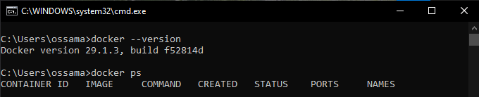

### 2. Lancer un serveur Nginx dans un conteneur
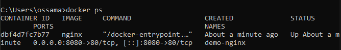
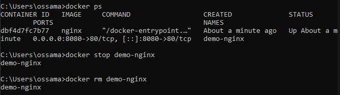
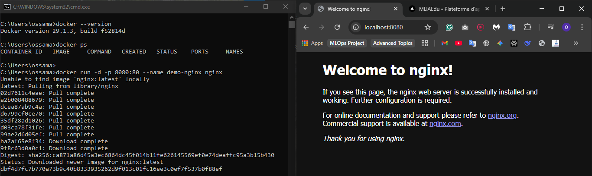

### 3. Ouvrir un shell Linux isolé dans un conteneur
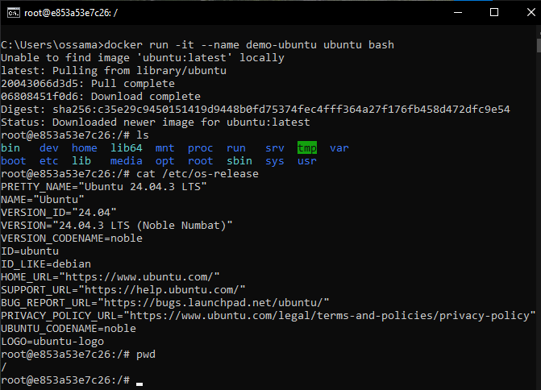
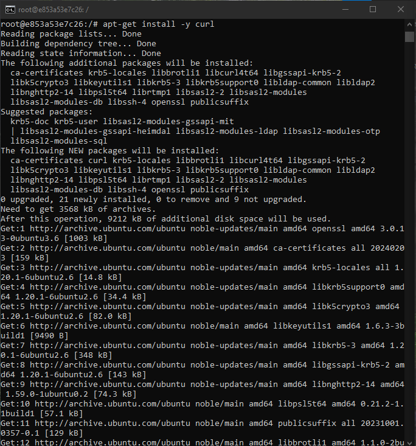
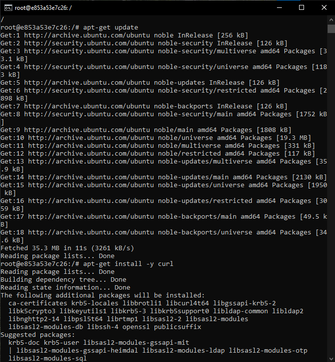
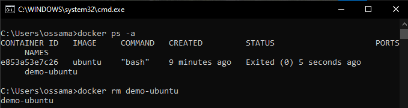

### 4. Comprendre la structure d’une commande docker run
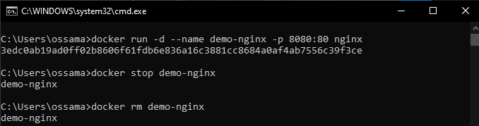

### 5. Conteneuriser l’API churn du projet mlops-lab-01
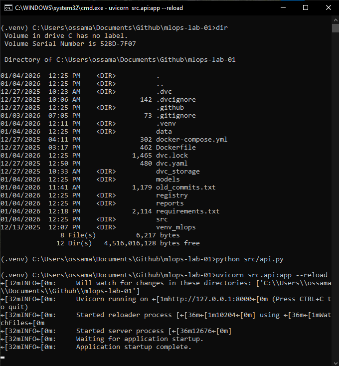

### 6. Créer un fichier requirements.txt pour l’image Docker
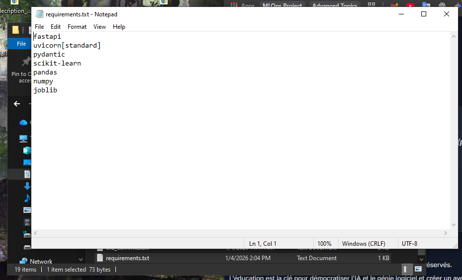

### 7. Créer un Dockerfile pour l’API churn
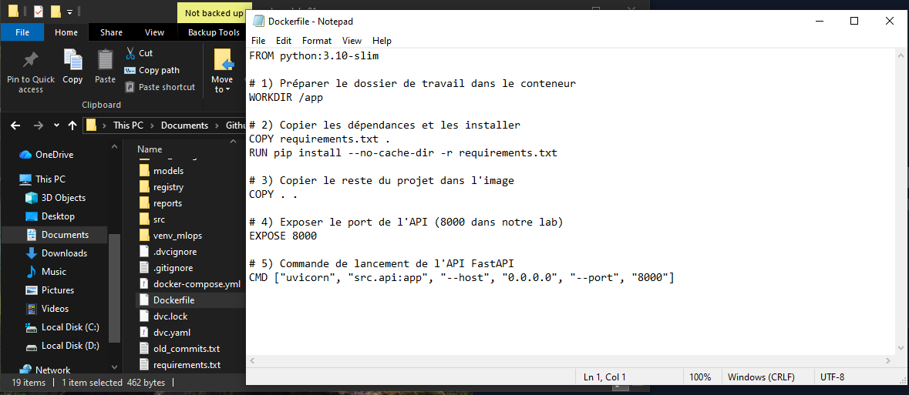

### 8. Préparer un modèle actif avant de construire l’image
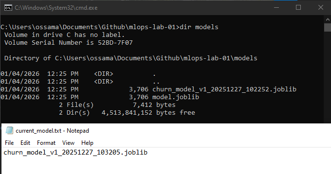
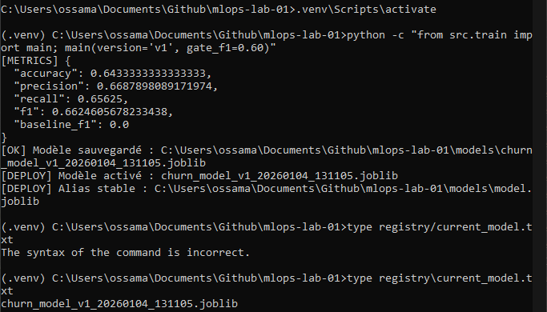

### 9. Construire l’image Docker du projet churn
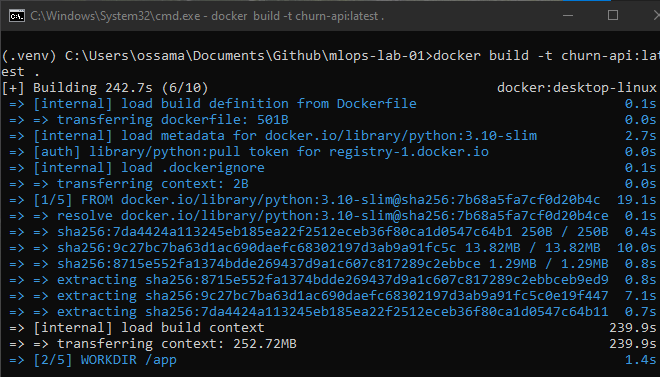
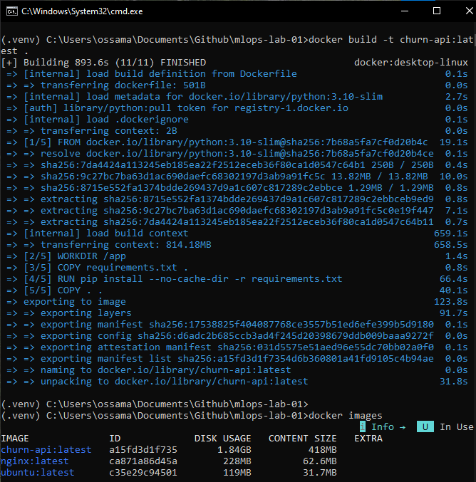

### 10. Lancer l’API churn dans un conteneur
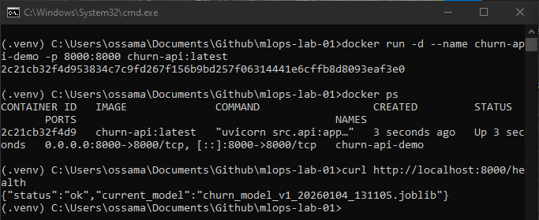
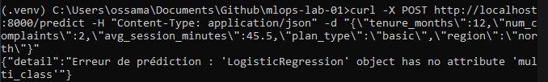
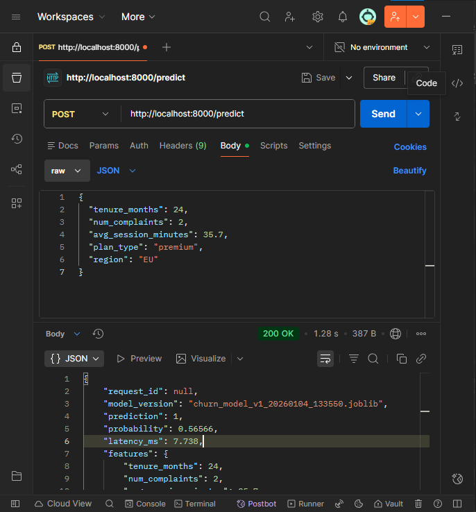

### 11. Vérifier les logs générés à l’intérieur du conteneur
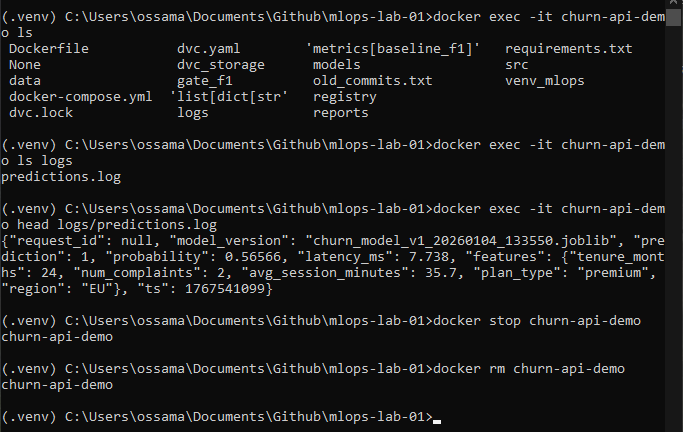

### 12. Orchestration locale avec Docker Compose
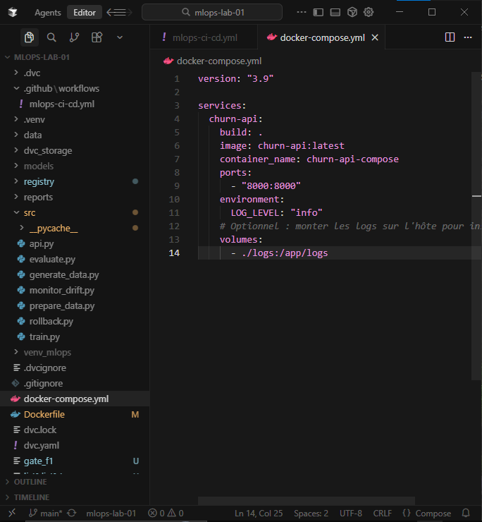

### 13. Démarrer l’API via Docker Compose
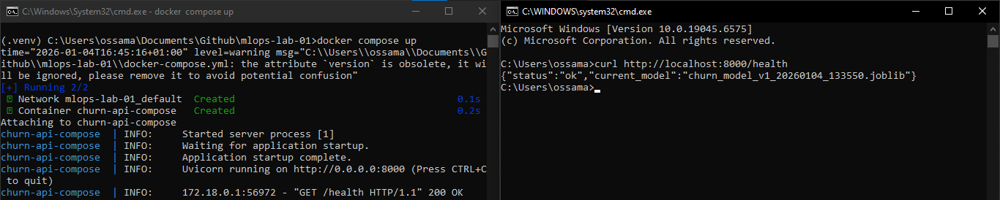
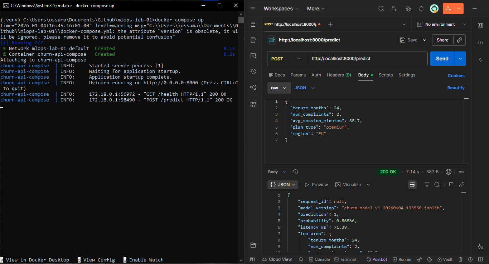

### 14. Lancer les services en arrière-plan et observer les logs
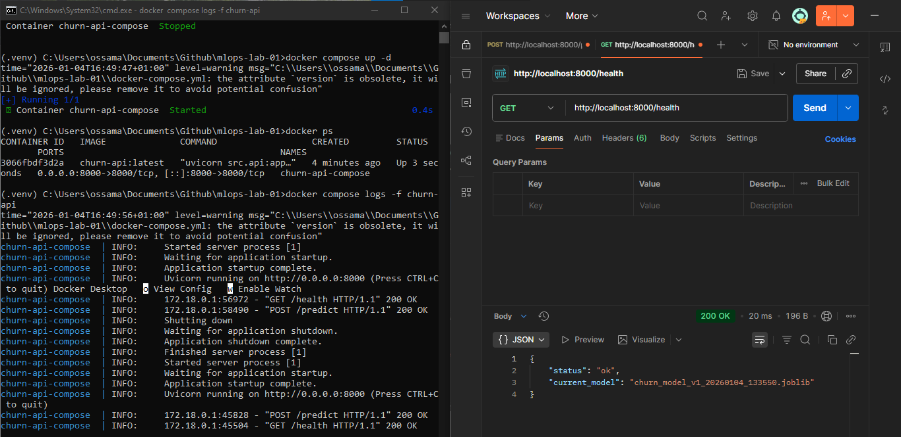
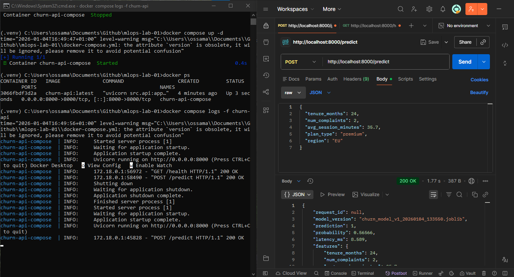
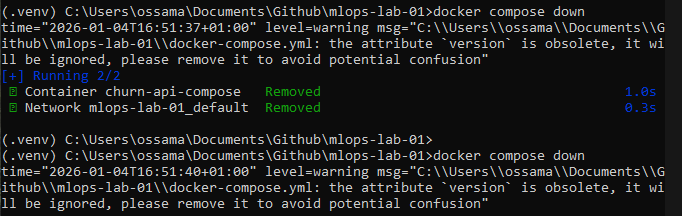

### 15. Lier Docker Compose au reste du cours (Git + DVC)

